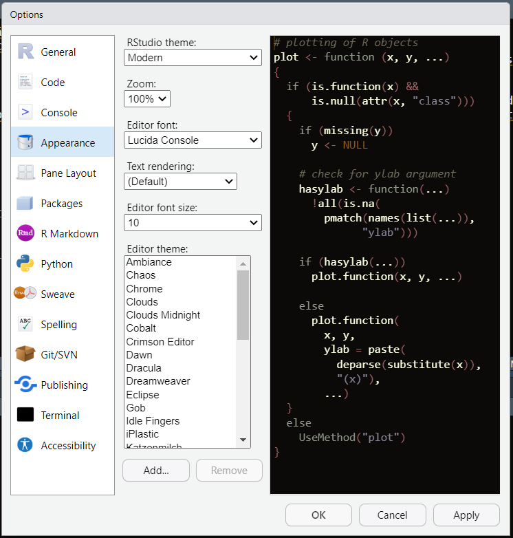

# Primeiros passos{-}

## História {-}

R é uma linguagem de programação para análise estatística criada em 1993 por Ross Ihaka e Robert Gentleman da Universdade de Auckland, Nova Zelândia. Foi inspirada na linguagem S, e por ser sua sucessora (e pela inicial dos autores), recebeu o nome R.

O "Comprehensive R Archive Network" (CRAN) foi criado em 1997 por Kurt Hornik e Fritz Leisch para armazenar o código fonte, documentação, e pacotes do R. O "R Core Team" foi formado em 1997 para desenvolver a linguagem, e em 2003 a "R Foundation" foi fundada para ajudar o projeto R. Em 2011 foi lançado o RStudio, um ambiente de desenvolvimento integrado para R.

Obs: o código fonte está livre para uso sob licencsa GNU General Public Licence; o código fonte R utiliza scripts em C, C++, .Net, e Python para maior eficiência. 

## Por que R? {-}

O R foi desenvolvido para análise estatística, então provê uma grande comunidade e variedade de pacotes acerca de temas como análise e vizualização de dados, modelos estatísticos, data science e machine learning. Embora consiga fazer uma grande gama de outros processos não relacionados aos supracitados, costuma ter menor eficiência em comparação a linguagens mais generalistas como Python, e C.

O R, com sua estrutura de linguaem de programação, pode ser considerado mais difícil de usar que seus competidores "point and click" SAS, SPSS, Stata, Eviews, GRETL, entre outros, mas ao mesmo tempo, essa estrutura dá mais liberdade ao usuário, permitindo a resolução de problemas menos comuns.

## Instalação {-}

É preciso instalar o R e o RStudio, veja como [neste tutorial](https://www.curso-de-programacao-em-r-para-jornalistas.com/2019/10/27/instalacao-r-e-rstudio/) do curso "R Para Jornalistas". Obs: coincidentenmente, a maneira que jornalistas instalam o R serve para qualquer outra profissão também.

## Interface e ferramentas {-}

Existêm vários tutoriais online explicando a interface, como o da [Datacamp](https://www.datacamp.com/tutorial/r-studio-tutorial) (veja até "How to Write R Scripts in RStudio") e este [vídeo no youtube](https://www.youtube.com/watch?v=FIrsOBy5k58).

Além disso, existem três configurações mais comuns de serem alteradas: alterar onde os arquivos são salvos por padrão (figura 1, "browse"); impedir que os dados da última vez que você entrou no R sejam recarregados quando você voltar (figura 1, "workspace"); e alterar aparência (figura 2). Todas elas podem ser encontradas na tab _Tools > Global Options_:

{width=300px} {width=300px}

Mais informações úteis sobre a interface podem ser encontradas na Seção ["Navigating the Software"](https://rc2e.com/navigatingthesoftware) do livro "R Cookbok 2nd Edition".
